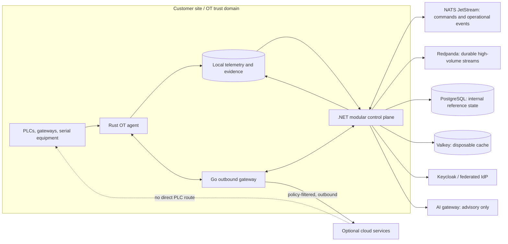

# Architecture assessment and gap analysis

Status: proposed baseline, 2026-09-27. Repository inspection found no application files, deployment manifests, tests, or prior architecture. Nothing described below is an existing production capability except the explicitly identified Rust policy gate.

## Intended system boundary

The product observes and administers industrial and supporting infrastructure. It is not a safety instrumented system, PLC runtime, or deterministic process controller. A site must remain operable during WAN, cloud, and Waylorn outages. Any command that could affect a physical process needs a separate safety case, site approval, and hardware/process interlocks outside Waylorn.

The diagram is logical: deployment modes place these components at different locations. Air-gapped mode omits cloud conduits. No data crosses a trust boundary without identity, authorization, egress classification, and an audit record. A cloud-origin request terminates at the site gateway and is re-evaluated locally; it never becomes a raw network tunnel into a PLC subnet.

## Boundaries and ownership

| Boundary | Owner | Contract and failure behavior |
| --- | --- | --- |
| Equipment ↔ site agent | Rust | Protocol-specific adapters, bounded parsing, explicit operations; unknown equipment read-only. Loss of adapter stops collection, never initiates a write. |
| Site ↔ external network | Go | Outbound-established mTLS connection, allowlisted routing and multiplexing. WAN loss queues allowed events locally; no remote command execution. |
| Domain/API ↔ storage | .NET 10 | Modular monolith, tenant/site scopes, backend RBAC and ABAC, transactional command and audit records. Database failover makes mutations unavailable until consistency is restored. |
| Identity ↔ control plane | Keycloak | Federation, short-lived human/workload credentials; cached identity does not authorize new consequential operations during IdP outage. |
| Modules ↔ event systems | NATS / Redpanda | NATS owns commands, acknowledgements, health, and short-lived operational state. Redpanda owns telemetry, security/audit, and integration history. Neither is authoritative for approvals or asset identity. |
| Control plane ↔ AI | AI gateway | Classification and egress policy before model calls. Model output is advisory and cannot invoke physical-process commands. |
| Third-party connector ↔ product | Constrained connector runtime | Signed identity, scoped APIs/events/secrets, network and resource limits, revocation, audit. Connector cannot bypass domain authorization. |

## Canonical domain model

An `Asset` has stable opaque ID, kind (`IndustrialAsset`, `ComputeAsset`, `NetworkAsset`, `CloudResource`, `StorageAsset`, `ApplicationAsset`, `SecurityAsset`), organization/site/zone ownership, lifecycle, provenance, and classification. An industrial extension holds manufacturer, model, serial, firmware, protocols, interfaces, telemetry definitions, configuration references, security posture, maintenance, and business owner. Discovered identifiers are claims until reconciled; never merge assets solely on IP or network address.

Relationships are typed rows with source asset, target asset, relation, validity interval, provenance, and review state. Initial relation types: `CONTROLS`, `CONNECTED_TO`, `DEPENDS_ON`, `PROGRAMMED_BY`, `MONITORED_BY`, `HOSTED_ON`, `SENDS_DATA_TO`, `REPRESENTED_BY`, `PROTECTED_BY`. A relational database with indexed adjacency queries is the default. Revisit graph storage only with measured query pressure.

Every asset capability is separately represented as `observed`, `declared`, `site-approved`, and `currently-authorized`; discovery alone cannot grant a write. Device interfaces carry network zone, protocol, address reference, and gateway path. Sensitive addresses and configurations stay in the site's local store by default.

## Control-plane modules

The initial .NET 10 process owns modules with explicit APIs and module-owned tables. No module reads another module's private tables. Cross-module changes use transactional application services; publish events through an outbox only after commit.

| Module group | Modules | Primary ownership |
| --- | --- | --- |
| Tenant and topology | Organizations, Regions, Sites, Zones, ProductionLines, Assets, Topology | Hierarchy, stable IDs, asset reconciliation, relationships |
| Access and action | Identity, Authorization, Policies, Commands, Audit | Principal mapping, decision policy, command state, evidence references |
| Operations | TelemetryMetadata, Reliability, Maintenance, Security, Incidents, Certificates, Firmware, Vulnerabilities | Data definitions, analysis metadata, work and security lifecycle |
| Platform | Integrations, Storage, Cloud, AI, Licensing, Billing | Connector contracts, data lifecycle, provider gateways, commercial entitlements |

Billing and licensing never sit on the OT execution path. A license or billing outage must not alter factory control or silently change command authorization. High-throughput telemetry ingestion and analysis can be extracted only when profiling and operational evidence justify it.

## Command path

1. Client presents a short-lived identity and an idempotency key to the .NET API.
2. API validates tenant, site, zone, asset, capability, action class, origin, device posture, authentication strength, maintenance window, and change ticket. It records the decision and immutable request digest.
3. GREEN observation may be scheduled under read policy. AMBER administrative changes require policy/change control. RED process-impacting actions require a named human's explicit, fresh approval and an independent site safety gate; an LLM or service identity cannot supply it.
4. Approved request is placed on NATS with expiry, correlation ID, schema version, and replay protection. The site independently re-authorizes before execution. Acknowledgement and outcome are audited locally.
5. No acknowledgement is interpreted as success. Timeout, partition, stale approval, missing audit store, or uncertain device state stops execution and requires reconciliation before retry.

This path is a design target, not implemented. The current Rust gate rejects AMBER and RED unconditionally.

## Data and event ownership

| Class | Transport | Authority / retention |
| --- | --- | --- |
| Command request, approval reference, acknowledgement, site health | NATS JetStream | PostgreSQL owns approval and asset state; local append-only evidence owns execution proof. Short operational retention. |
| Raw telemetry, security events, audit stream, integration change log | Redpanda | Local hot store and policy-defined archive; stream is replayable transport, not sole evidence store. |
| Historical analytical data | Parquet + Zstandard on local S3-compatible storage | Retention and WORM policy by classification. |
| Cached inventory views and non-authoritative session hints | Valkey | Rebuildable; loss reduces performance, not correctness. |

Schemas are versioned; consumers must reject unknown incompatible major versions and preserve unknown fields when forwarding. Use Protobuf or Avro after producer/consumer compatibility tests. Avoid per-record gzip. Audit evidence needs hash chains or signed manifests, trusted time source, and immutable storage; design and verification remain open.

## Integration and deployment stance

Rust owns OPC UA, Modbus TCP/RTU, S7, EtherNet/IP/CIP, BACnet/IP, MQTT, and Sparkplug B adapters as separate, testable modules. PROFIBUS, PROFINET, CAN/CANopen, DeviceNet, serial links, vendor SDKs, and external gateways are extension routes. Protocol support is conditional on hardware, license, and safe lab validation. C/C++ is restricted to isolated FFI boundaries. Customer-developed adapters need signing, constrained process isolation, and conformance tests.

Go owns outbound site networking; .NET owns the domain and APIs; R owns reproducible reliability statistics; Python owns ML; TypeScript owns clients. Java/Kotlin use SDKs and connector APIs. Customer PostgreSQL, SQL Server, Oracle, and MySQL are integration endpoints, not alternate internal persistence engines.

Build the same signed OCI artifacts for SaaS, customer cloud, hybrid, on-premises, and air-gapped deployments. RHEL with SELinux enforcing is the reference environment. Kubernetes is optional where orchestration helps; Podman is supported for smaller sites. OT agents are placed and scaled by site engineering, never automatically shifted by queue depth. Cloudflare, Akamai, Azure Front Door, AWS equivalents, and customer ingress are edge options for human-facing APIs. CAPTCHA never enters machine paths.

Marid and AegisCore may have deeper native workflows; SIEM/SOC and ERP/MES/CMMS integrations must use open interfaces with equivalent core data access and no intentional degradation. Cloud inventory/cost connectors are read-scoped and support AWS, Azure, GCP, Hetzner, private cloud, and bare metal as APIs permit.

Connector SDK contracts are planned for Rust, Go, .NET, Java/Kotlin, Python, and TypeScript where relevant. A connector manifest declares identity, API scopes, event subscriptions, network destinations, secret access, CPU/RAM ceilings, and revocation behavior. Connector audit events include package digest and identity. No third-party connector may load into the OT agent process without a separate isolation ADR and validation.

OpenTelemetry will collect CPU, RAM, load, disk and I/O, filesystem, temperature where sensors exist, network bandwidth/loss/latency, uptime, containers, Podman/Kubernetes, NATS, Redpanda, Valkey, databases, certificates, storage, and application health. Exporters must honor local classification policy and support customer observability stacks. Raw telemetry payloads, recipes, and credentials must not enter tracing attributes.

R jobs will own reproducible availability, MTBF, MTTR, Weibull/survival, confidence interval, trend, cohort, and degradation calculations. Python jobs may produce anomaly, failure, remaining-life, sensor drift, and communication-degradation estimates with model version, training provenance, feature definitions, timestamp, uncertainty, and lineage. Neither LLM output nor ML predictions become authoritative reliability metrics or command approval.

The AI gateway is the only model egress path. It supports local providers (Ollama, LM Studio, vLLM, llama.cpp), OpenAI-compatible endpoints, and optional OpenAI, Azure OpenAI, Anthropic, Gemini, IBM watsonx, or custom adapters. Classification, redaction, pseudonymization, aggregation, DLP, and any required human approval run before external egress. Tools are typed and scoped; no tool directly controls physical processes.

## Gap analysis

| Area | Today | Required before production |
| --- | --- | --- |
| OT safety | Pure Rust gate rejects AMBER/RED | Real adapters, parser fuzzing, site safety case, hardware-in-loop validation, isolation, explicit approved writes |
| Identity and authorization | None | Keycloak federation, machine identity, RBAC+ABAC, offline policy behavior, auditable decisions |
| Asset model | Documented only | Migrations, reconciliation, provenance, topology queries, tenant isolation |
| Network plane | None | mTLS, certificate rotation, outbound tunnels, allowlisted routing, partition tests |
| Eventing/storage | None | Versioned contracts, outbox/inbox, local store-and-forward, retention, integrity verification |
| Data egress/AI | None | Classification, DLP, redaction, gateway policy, tool sandbox, no direct process controls |
| Operations | None | RHEL hardening, observability, signed release pipeline, backup/restore, runbooks |
| Interoperability | None | Protocol and connector conformance harnesses, vendor/lab matrix |
| Evidence | Unit tests only | Threat review, security tests, traceable requirements, independent assessment |

This is an engineering plan, not an IEC 62443 conformance or certification claim.
