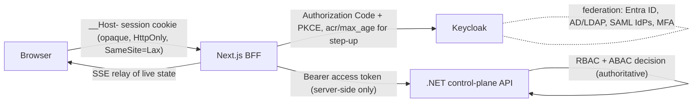

# Frontend architecture and implementation plan

Status: proposed baseline, 2026-09-27. Owner: frontend architecture. Read with [system architecture](../architecture.md), [threat model](../threat-model.md), and ADRs 0006–0013.

## 1. Repository assessment (before this change)

| Found | Consequence for the frontend |
| --- | --- |
| Architecture, threat model, IEC 62443 map, ADR 0001–0005 | Frontend decisions must preserve: backend-authoritative RBAC/ABAC, GREEN/AMBER/RED command classes, "no acknowledgement ≠ success", local-first data, single AI gateway, LLM never holds a process-command tool. |
| Rust `ot-core` gate (no I/O) | Its `Operation` → `Risk` mapping is the reference for safety-class vocabulary in the UI. The UI never re-derives a class; it renders the class returned by the backend. |
| No .NET API, no OpenAPI, no Keycloak realm, no brokers | There is nothing to integrate against. The frontend therefore starts **contract-first**: a draft OpenAPI document in `contracts/` that the .NET control plane must adopt or replace. No screen claims a live integration that does not exist. |
| No JavaScript tooling | Greenfield workspace. No working architecture is being replaced. |

## 2. Workspace layout

```
contracts/
  openapi/control-plane.v0.yaml   Draft API contract (ADR 0007). Source of truth for generated types.
packages/
  contracts/      Generated OpenAPI types + typed fetch client. No hand-written DTOs.
  domain/         Pure, framework-free domain logic shared by web and mobile:
                  safety-class presentation, freshness/staleness, tenancy paths,
                  ML/analytics provenance formatting, safe redirect validation.
  design-tokens/  Colour, spacing, type, and status tokens (CSS + TS for React Native).
apps/
  web/            Next.js App Router operator console (desktop-first).
  mobile/         Expo / React Native field app (alerts, approvals, lookup, maintenance).
tools/
  dev-fixtures/   Development-only API + OIDC issuer serving labelled fixture data.
                  Never bundled into apps; refused when NODE_ENV=production.
```

## 3. Request, identity and trust flow



- Tokens never reach browser JavaScript. The browser holds an opaque session ID; the BFF holds tokens (ADR 0008).
- Server Components call the API directly with the session's access token. Client Components call `/api/bff/*`, which enforces CSRF checks, forwards an allowlisted path set, and attaches the token.
- Every API response carries `permittedActions` / decision metadata computed by the backend. The UI uses it only to hide or explain unavailable actions; the backend re-evaluates on every request (ADR 0008, section "Authorization").

## 4. Information architecture

Seventeen product areas are grouped into five workspaces so the primary navigation stays at five entries with a secondary list per workspace. Keyboard: `Ctrl/⌘+K` command palette reaches any area, asset, or site; `g` then letter jumps between workspaces.

| Workspace | Areas |
| --- | --- |
| **Operate** | Overview, Sites, Industrial Assets, Topology, Incidents, Maintenance |
| **Observe** | Telemetry, Infrastructure, Reliability, Cloud, Storage |
| **Secure** | Security, Policies, Access, Audit |
| **Intelligence** | AI Assistant, AI Governance, Reports |
| **Administer** | Integrations, Domains & Edge, Administration |

Persistent context bar (always visible, never scrolls away): organization · site · environment (production / staging / lab) with a distinct environment band colour and text label, connection state, data-freshness state, and signed-in principal. Consequential dialogs repeat the context inside the dialog body.

Route shape encodes tenancy so a URL can never be ambiguous about the plant being acted upon:

```
/o/{orgSlug}/overview
/o/{orgSlug}/assets?site=…&kind=…&q=…&cursor=…
/o/{orgSlug}/assets/{assetId}/{view}
/o/{orgSlug}/topology?focus={assetId}&depth=…&relations=…
/o/{orgSlug}/audit?…
```

## 5. Rendering and data strategy

| Concern | Approach |
| --- | --- |
| Lists (assets, events, audit) | Server-side filter/sort/cursor pagination; URL search params are the filter state, so views are linkable and back-button safe. Page size ≤ 100. Long event logs virtualised with `@tanstack/react-virtual`. |
| Asset page | Nested routes per view (`/assets/{id}/telemetry` …). Each view loads only its own data (progressive disclosure). |
| Telemetry | Browser requests a time range + target point count; server returns min/mean/max aggregates. Hard client cap (`MAX_SERIES_POINTS`) rejects oversized responses. |
| Live state | SSE via BFF relay. Every value carries `observedAt`; UI classifies fresh / delayed / stale / unknown from server-supplied expectation intervals, and shows the classification in text, not only colour (ADR 0009). |
| Topology | Server returns a bounded neighbourhood (focus, depth, relation filter) plus cluster summaries for everything beyond the bound. Client never holds more than `TOPOLOGY_NODE_BUDGET` nodes; expansion is explicit. A tabular view is always available (ADR 0011). |
| Analytics / ML | Rendered only from backend results with method, version, interval, freshness. ML shown as estimates with uncertainty and contributing signals; the UI never calculates MTBF/MTTR or availability. |
| Caching | RSC fetches default to `no-store` for operational data; reference data (sites, hierarchy) revalidated with tags. No operational data in `localStorage`. |

## 6. Command safety UX (ADR 0010)

Commands follow `select → preflight (backend policy evaluation) → review → authenticate (step-up where required) → confirm → submitted → acknowledged/outcome`. The review panel always shows WHAT, WHERE (org/site/zone/line), TARGET asset with stable ID, WHO, WHY (operator-entered reason, and change ticket where policy requires one), and the POLICY that permits it. RED requires fresh step-up (`max_age=0`, elevated `acr`), typed confirmation of the target identifier, and never offers a default-focused confirm button. The UI states "submitted — outcome not yet confirmed" until the backend reports a reconciled outcome; timeouts display as **Unknown outcome**. Today the backend (and the Rust gate) reject AMBER/RED; the UI renders that decision rather than hiding it.

## 7. Security baseline in the web tier

- Headers: nonce-based CSP (`script-src 'nonce-…' 'strict-dynamic'`, `frame-ancestors 'none'`, `object-src 'none'`, `base-uri 'none'`, `form-action 'self'` + IdP), HSTS (`max-age=63072000; includeSubDomains; preload` configurable), `X-Content-Type-Options: nosniff`, `Referrer-Policy: no-referrer`, `Permissions-Policy`, `Cross-Origin-Opener-Policy: same-origin`, `Cross-Origin-Resource-Policy: same-origin`.
- Cookies: `__Host-` prefix, `Secure`, `HttpOnly`, `SameSite=Lax` (session) / `Strict` (CSRF token); rotated on login and step-up.
- CSRF: BFF rejects unsafe methods unless `Sec-Fetch-Site`/`Origin` is same-origin **and** the `x-waylorn-csrf` header matches the session-bound token.
- Redirects: only relative, single-slash paths are accepted as `returnTo`; anything else resolves to the org overview.
- Supply chain: lockfile committed, `pnpm install --frozen-lockfile` in CI, exact version pins, `onlyBuiltDependencies` allowlist, no runtime CDN scripts, no Google-hosted fonts (air-gapped builds).
- Edge protection (Cloudflare/Akamai/Front Door/customer ingress) is a deployment concern; Turnstile-style challenges are supported on the human login surface only through Keycloak's login theme, never on BFF or API machine paths (ADR 0013).

## 8. Implementation phases (frontend)

| Phase | Scope | Exit evidence |
| --- | --- | --- |
| F0 (this change) | Workspace, contracts, domain package, tokens, security headers, OIDC BFF, shell/navigation, context bar, asset list/detail (overview, live, telemetry, reliability, topology, events, audit), topology explorer, command safety flow, audit search, AI assistant/governance, domains, fixture server, mobile skeleton, test harnesses | Typecheck, lint, unit/component/a11y tests, Playwright E2E + a11y + visual baselines against fixtures |
| F1 | Adopt real .NET OpenAPI; retire draft contract; Valkey session store; Keycloak realm export + login theme; production container image | Contract tests against backend, IdP integration tests, multi-instance session tests |
| F2 | Remaining area depth (maintenance work orders, policy editor, access reviews, report builder, integration catalogue) as backend modules land | Per-module E2E, usability sessions with operators |
| F3 | Mobile approvals with device-bound step-up, push via backend | Device security review, offline/degraded tests |
| F4 | AMBER command execution UI against real workflow | Hazard review sign-off, operator usability study (ADR 0002) |

## 9. Implementation status (F0)

| Area | State |
| --- | --- |
| Overview, Sites, Assets (13 views), Topology, Incidents, Infrastructure, Cloud & cost, Storage, Reliability reviews, Audit, AI assistant, AI governance, Domains & edge | Implemented against the draft contract and fixture server |
| Maintenance (org-wide), Telemetry explorer, Security posture, Policies, Access, Reports, Integrations, Administration | Reachable in navigation, marked "planned"; each page names the missing backend API. Per-asset maintenance, telemetry and security views exist. |
| Command execution | Full request ceremony implemented; the backend (and the Rust gate) reject AMBER/RED, and the UI reports that outcome |
| Mobile | Alerts, approvals (review only), asset lookup with snapshot values and work orders, site health; type-checked, linted, Metro-bundled |

## 10. What is intentionally not implemented

- No live telemetry or device data: all data in development comes from `tools/dev-fixtures`, every fixture response is marked `x-waylorn-data-source: fixture`, and the UI shows a persistent **Development fixture data** banner when it sees that header.
- No Valkey session adapter yet: the in-memory store is single-instance and production start-up refuses it unless `WAYLORN_ALLOW_SINGLE_INSTANCE_SESSIONS=true` acknowledges a single-replica deployment.
- No RED/AMBER execution path exists; the flow ends at the backend's decision.
- Mobile approval actions: review only until device-bound step-up is designed (ADR 0013).
- Storybook is deferred (ADR 0012); component tests and the fixture-backed app serve as living documentation until the component set stabilises.
